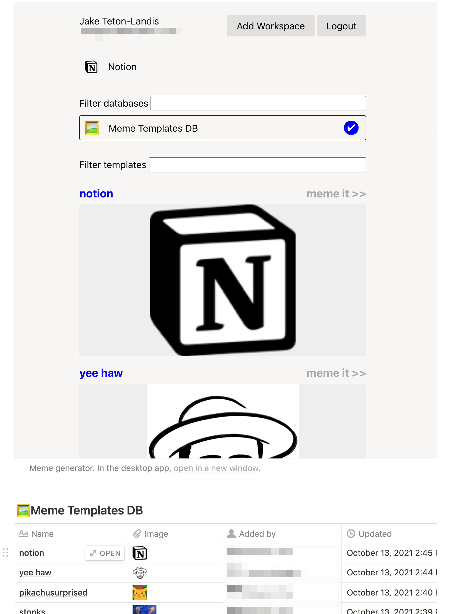

# **memegentino**

A simple meme generator that can produce memes from a Notion database of meme
templates. Uses the Notion OAuth API to connect to your Notion workspaces. Embed
it in an iframe for easy memeing from Notion.

[Get Memegentino for your Notion workspace](https://jitl.notion.site/Memegentino-a88d462ab4d7482c870b1120d4dc49d5)!



## Getting Started

You will need:

- A postgres database, perhaps from [Supabase](https://supabase.io/)
- A [Notion integration](https://developers.notion.com/docs/getting-started) configured as a [public OAuth integration](https://developers.notion.com/docs/authorization#authorizing-public-integrations)

Ensure the `.env.local` file has required environment variables:

```
NOTION_BASE_URL=https://api.notion.com
NOTION_CLIENT_ID=<uuid of your notion integration>
NOTION_CLIENT_SECRET=<secret of your notion integration>
DATABASE_URL=postgresql://<YOUR_DB_USERNAME>@localhost:5432/memegentino
```

## Development

Run your app in the development mode.

```
blitz dev
```

Open [http://localhost:3000](http://localhost:3000) with your browser to see the result.

## Production

For preview and production environments, you additionally should configure
`NEXT_PUBLIC_BASE_URL` to be the HTTP URL prefix for your app, this defaults to
`http://localhost:3000`. This is used for Notion OAuth redirects.

Note that if you're using Supabase, you should use the PGBouncer URL in _preview_ and
_production_ environments with `?pgbouncer=true`.

```
...
NEXT_PUBLIC_BASE_URL=https://<my-app-name>.com
DATABASE_URL=postgres://<USER:PASS>@db.<SUPABASE>.supabase.co:6543/postgres?pgbouncer=true
```

## Commands

Blitz comes with a powerful CLI that is designed to make development easy and fast. You can install it with `npm i -g blitz`

```

blitz [COMMAND]

dev Start a development server
build Create a production build
start Start a production server
export Export your Blitz app as a static application
prisma Run prisma commands
generate Generate new files for your Blitz project
console Run the Blitz console REPL
install Install a recipe
help Display help for blitz
test Run project tests

```

You can read more about it on the [CLI Overview](https://blitzjs.com/docs/cli-overview) documentation.

## What's included?

Here is the starting structure of your app.

```

memegentino
├── app/
│   ├── api/
│   ├── auth/
│   │   ├── mutations/
│   │   │   └── logout.ts
│   ├── core/
│   │   ├── components/
│   │   │   ├── Form.tsx
│   │   │   └── LabeledTextField.tsx
│   │   ├── hooks/
│   │   │   └── useCurrentUser.ts
│   │   └── layouts/
│   │   └── Layout.tsx
│   ├── pages/
│   │   ├── 404.tsx
│   │   ├── \_app.tsx
│   │   ├── \_document.tsx
│   │   ├── index.test.tsx
│   │   └── index.tsx
│   └── users/
│   └── queries/
│   └── getCurrentUser.ts
├── db/
│   ├── index.ts
│   ├── schema.prisma
│   └── seeds.ts
├── integrations/
├── mailers/
│   └── forgotPasswordMailer.ts
├── public/
│   ├── favicon.ico\*
│   └── logo.png
├── test/
│   ├── setup.ts
│   └── utils.tsx
├── README.md
├── babel.config.js
├── blitz.config.js
├── jest.config.js
├── package.json
├── tsconfig.json
├── types.d.ts
├── types.ts
└── yarn.lock

```

These files are:

- The `app/` folder is a container for most of your project. This is where you’ll put any pages or API routes.

- `db/` is where your database configuration goes. If you’re writing models or checking migrations, this is where to go.

- `public/` is a folder where you will put any static assets. If you have images, files, or videos which you want to use in your app, this is where to put them.

- `integrations/` is a folder to put all third-party integrations like with Stripe, Sentry, etc.

- `test/` is a folder where you can put test utilities and integration tests.

- `package.json` contains information about your dependencies and devDependencies. If you’re using a tool like `npm` or `yarn`, you won’t have to worry about this much.

- `tsconfig.json` is our recommended setup for TypeScript.

- `.babelrc.js`, `.env`, etc. ("dotfiles") are configuration files for various bits of JavaScript tooling.

- `blitz.config.js` is for advanced custom configuration of Blitz. It extends [`next.config.js`](https://nextjs.org/docs/api-reference/next.config.js/introduction).

- `jest.config.js` contains config for Jest tests. You can [customize it if needed](https://jestjs.io/docs/en/configuration).

You can read more about it in the [File Structure](https://blitzjs.com/docs/file-structure) section of the documentation.

### Tools included

Blitz comes with a set of tools that corrects and formats your code, facilitating its future maintenance. You can modify their options and even uninstall them.

- **ESLint**: It lints your code: searches for bad practices and tell you about it. You can customize it via the `.eslintrc.js`, and you can install (or even write) plugins to have it the way you like it. It already comes with the [`blitz`](https://github.com/blitz-js/blitz/tree/canary/packages/eslint-config) config, but you can remove it safely. [Learn More](https://eslint.org).
- **Husky**: It adds [githooks](https://git-scm.com/docs/githooks), little pieces of code that get executed when certain Git events are triggerd. For example, `pre-commit` is triggered just before a commit is created. You can see the current hooks inside `.husky/`. If are having problems commiting and pushing, check out ther [troubleshooting](https://typicode.github.io/husky/#/?id=troubleshoot) guide. [Learn More](https://typicode.github.io/husky).
- **Prettier**: It formats your code to look the same everywhere. You can configure it via the `.prettierrc` file. The `.prettierignore` contains the files that should be ignored by Prettier; useful when you have large files or when you want to keep a custom formatting. [Learn More](https://prettier.io).

## Learn more

Read the [Blitz.js Documentation](https://blitzjs.com/docs/getting-started) to learn more.

The Blitz community is warm, safe, diverse, inclusive, and fun! Feel free to reach out to us in any of our communication channels.

- [Website](https://blitzjs.com/)
- [Discord](https://discord.blitzjs.com/)
- [Report an issue](https://github.com/blitz-js/blitz/issues/new/choose)
- [Forum discussions](https://github.com/blitz-js/blitz/discussions)
- [How to Contribute](https://blitzjs.com/docs/contributing)
- [Sponsor or donate](https://github.com/blitz-js/blitz#sponsors-and-donations)
